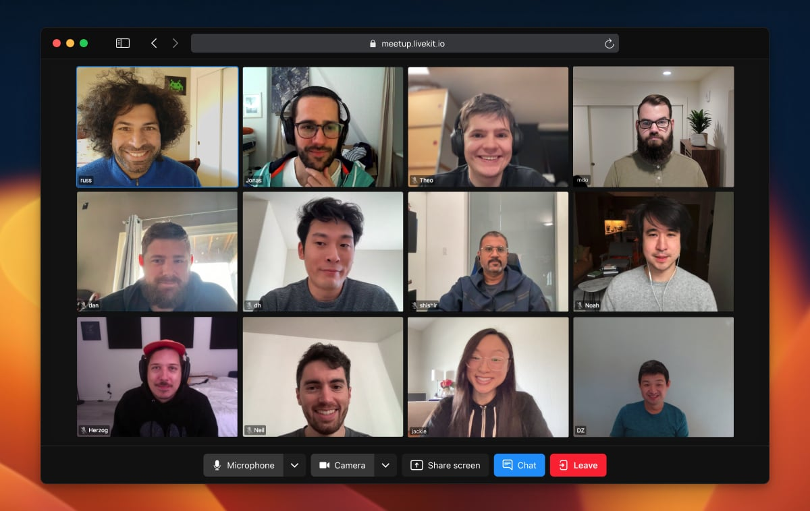

# LiveKit Meet

  <a href="https://meet.livekit.io"><strong>Try the demo</strong></a>
  •
  <a href="https://github.com/livekit/components-js">LiveKit Components</a>
  •
  <a href="https://docs.livekit.io/">LiveKit Docs</a>
  •
  <a href="https://livekit.io/cloud">LiveKit Cloud</a>
  •
  <a href="https://blog.livekit.io/">Blog</a>

 

LiveKit Meet is an open source video conferencing app built on [LiveKit Components](https://github.com/livekit/components-js), [LiveKit Cloud](https://cloud.livekit.io/), and Next.js. It's been completely redesigned from the ground up using our new components library.

## Tech Stack

- This is a [Next.js](https://nextjs.org/) project bootstrapped with [`create-next-app`](https://github.com/vercel/next.js/tree/canary/packages/create-next-app).
- App is built with [@livekit/components-react](https://github.com/livekit/components-js/) library.

## Demo

Give it a try at https://meet.livekit.io.

## Dev Setup

Steps to get a local dev setup up and running:

1. Run `pnpm install` to install all dependencies.
2. Copy `.env.example` in the project root and rename it to `.env.local`.
3. Update the missing environment variables in the newly created `.env.local` file.
4. Run `pnpm dev` to start the development server and visit [http://localhost:3000](http://localhost:3000) to see the result.
5. Start development 🎉

## LAN testing (two devices)

Use `pnpm dev:lan` to expose the app on your local network, then open `http://<your-lan-ip>:3000` on another device.

- Room join works over LAN HTTP.
- Camera/microphone are blocked by browsers on insecure HTTP contexts, so LAN HTTP runs in view-only mode.
- Use HTTPS (or a secure tunnel) if you need camera/mic from other devices.

## AI Recap Pipeline (Optional)

This repo can stream host screen-share frames and meeting transcript signals to a separate Python service.

1. Start the agent service from `/Users/kunalbajaj/hackathon/agent`:
   - `python3.13 -m venv .venv313`
   - `source .venv313/bin/activate`
   - `pip install -r requirements.txt`
   - `cp .env.example .env`
   - `uvicorn agent.main:app --host 0.0.0.0 --port 8787 --reload`
2. In `meet-main/.env.local`, set:
   - `NEXT_PUBLIC_AI_PIPELINE_ENABLED=true`
   - `AI_AGENT_BASE_URL=http://127.0.0.1:8787`
3. Join as host, start screen share, and the app will:
   - start an AI session,
   - sample screen frames at 1 fps,
   - forward frames to the agent,
   - poll rolling/final summaries.
